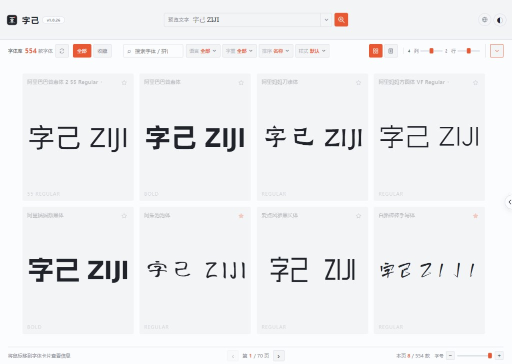
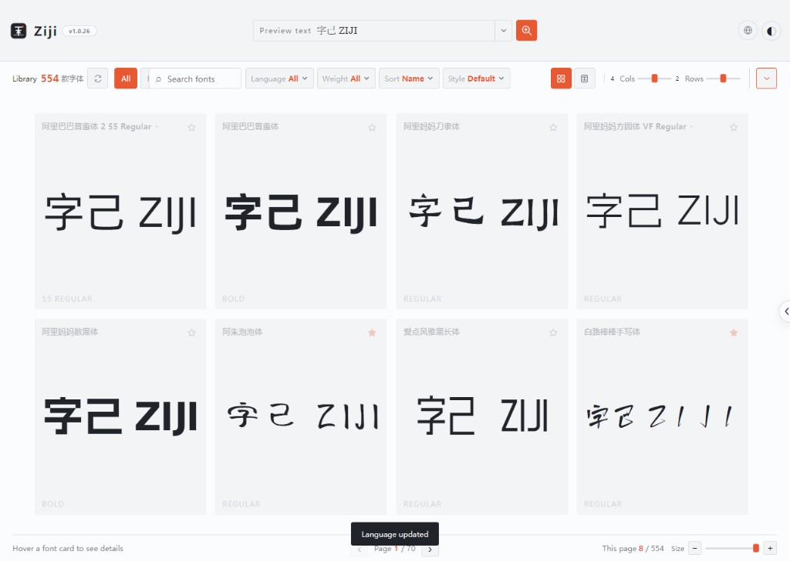

# 字己 · 本地系统字体预览器

> 阅字如阅己 — 找字体，也找自己

一个完全在浏览器本地运行的系统字体浏览、搜索与可变字体预览工具。字体数据不上传，所有处理都在本机完成。

[English README](./README.en.md)

## 直接使用

无需克隆仓库，在 **Chrome / Edge** 中打开以下链接即可使用（HTTPS，满足系统字体 API 要求）：

**[在线打开 ZIJI.html](https://cdn.jsdelivr.net/gh/Wonvy/ZIJI@main/ZIJI.html)**

| 方式 | 链接 |
| --- | --- |
| 在线使用（推荐） | [cdn.jsdelivr.net/gh/Wonvy/ZIJI@main/ZIJI.html](https://cdn.jsdelivr.net/gh/Wonvy/ZIJI@main/ZIJI.html) |
| 下载最新 Release | [releases/latest/download/ZIJI.html](https://github.com/Wonvy/ZIJI/releases/latest/download/ZIJI.html) |
| GitHub Pages | [wonvy.github.io/ZIJI/](https://wonvy.github.io/ZIJI/)（需在仓库 Settings → Pages 中将 Source 设为 **GitHub Actions** 后生效） |

## 预览





## 快速开始

Local Font Access API 需要安全上下文，请不要直接双击 `index.html`。在项目目录运行：

```powershell
node server.js
```

然后使用最新版 **Chrome** 或 **Edge** 打开 <http://localhost:4173>，点击「读取系统字体」并允许访问。

## 功能

- **本地读取** — 通过浏览器 API 读取系统已安装字体，不上传字体文件
- **实时预览** — 自定义预览文字、字号、字距、行高与配色
- **智能搜索** — 支持中文名称、拼音首字母即时搜索
- **可变字体** — 自动解析 OpenType `fvar` 表并调整可变字体轴
- **字形放大镜** — 跟随鼠标查看字形细节
- **收藏与筛选** — 按语言、字重、样式筛选，支持收藏分类
- **布局调节** — 网格 / 列表视图，可调列数、行数与卡片大小
- **深色主题** — 一键切换浅色 / 深色模式
- **多语言界面** — 支持中文、English、日本語、한국어 等 18 种语言

## 浏览器兼容性

| 浏览器 | 支持 |
| --- | --- |
| Chrome / Edge（最新版） | ✅ |
| Safari / Firefox | ❌ 暂不支持 `queryLocalFonts()` |

## 单文件版本

项目已内置单文件版 `ZIJI.html`（样式与脚本全部内联）。推荐通过上方 **[在线链接](https://cdn.jsdelivr.net/gh/Wonvy/ZIJI@main/ZIJI.html)** 直接使用；也可自行构建：

```powershell
node build-standalone.js
```

本地构建后，仍需通过 `node server.js` 或 HTTPS 访问才能调用系统字体 API。Release 版本见 [Releases](https://github.com/Wonvy/ZIJI/releases)。

## 隐私

字体仅在本机浏览器内读取与预览，不会上传到任何服务器。
